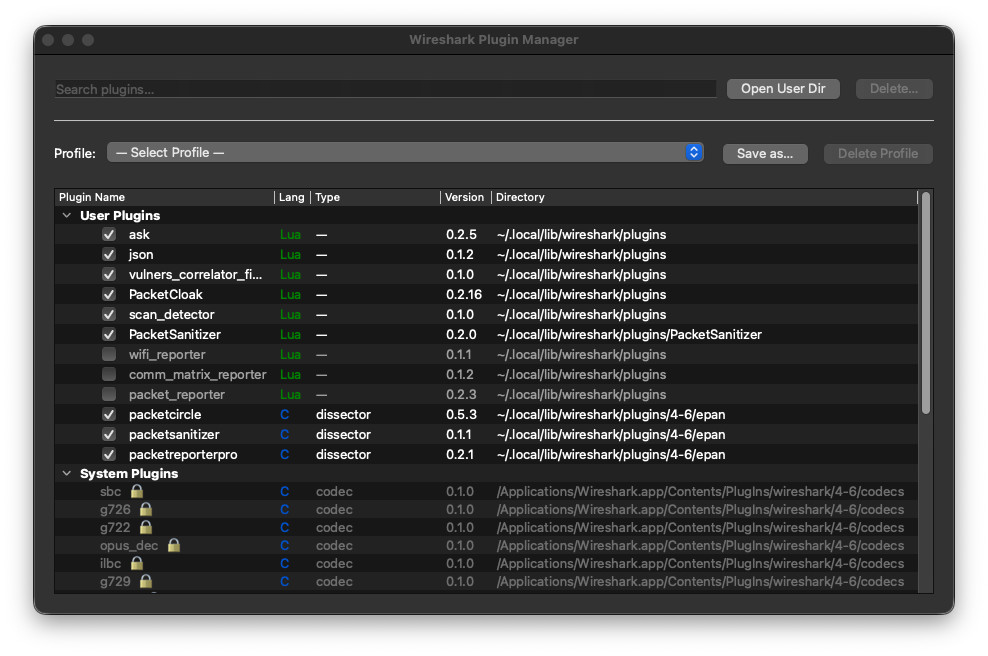

# WS-PluginManager

<p align="center">
  
</p>

[](CHANGELOG.md)
[](LICENSE)
[](https://www.wireshark.org/)
[](installer/macos-universal/)
[](installer/linux-x86_64/)
[](installer/windows-x86_64/)

**A native Wireshark plugin for managing all your other Wireshark plugins** — enable, disable, and organize plugins into named profiles without ever touching the file system manually. macOS Universal Binary (Intel + Apple Silicon), Linux x86_64 (all supported WS versions), and Windows x86_64.

---

## Why?

Every Wireshark plugin you install registers itself, occupies memory, and may interfere with dissectors loaded by other plugins. Over time, a collection of useful plugins slows startup and adds clutter to menus — even when most of them are irrelevant to what you are doing right now.

**Load only what you need for the task at hand.**

WS-PluginManager works by renaming unused plugin files with a `.disabled` suffix. No uninstalling, no copying files around — the plugin stays on disk, just dormant. One checkbox re-enables it.

**Work in profiles.** Save the current enabled/disabled state under a name — *Network Troubleshooting*, *Security Analytics*, *Wi-Fi Monitoring*, *Malware Triage* — and switch between them instantly. Each profile captures exactly which plugins are active, so you always load Wireshark with the right tool set for the job.

---

## Screenshot



*Plugin list with metadata columns, search bar, profile switcher, and enable/disable checkboxes.*

---

## Features

| Feature | Description |
|---|---|
| **Plugin list** | All installed plugins — Name, Language (C / Lua), Type (dissector · tap · filetype · codec), Version, and Directory |
| **Enable / disable** | Toggle a checkbox: the file is renamed `foo.so` ↔ `foo.so.disabled` — non-destructive, no uninstall |
| **Lua instant reload** | Lua plugins are re-registered immediately; no Wireshark restart needed |
| **C plugin banner** | Toggling a compiled plugin shows a restart reminder; changes take effect after restart |
| **Profiles** | Save, load, and delete named profiles — each profile stores the full enabled/disabled state of every plugin |
| **Search / filter** | Type to filter the list by name, language, or type in real time |
| **Open User Dir** | Opens your personal plugin folder in the system file manager |
| **Delete** | Permanently remove a plugin file — with confirmation |
| **Cross-platform** | macOS Universal Binary (Intel + Apple Silicon), Linux x86_64 |

---

## Download & Install

### macOS

```bash
cd installer/macos-universal
chmod +x install.sh
./install.sh
```

Detects your Wireshark version, shows any existing WS-PluginManager installation, and lets you choose between the personal plugin directory (recommended — survives Wireshark updates) or the application bundle.

### Linux

```bash
cd installer/linux-x86_64
chmod +x install.sh
./install.sh
```

Detects your Wireshark version and selects the matching binary automatically (WS 4.0.x through 4.6.x).

### Windows

```
cd installer\windows-x86_64
install.bat
```

Or open Command Prompt, `cd /d` to the `installer\windows-x86_64` folder, and run `install.bat`. Detects your Wireshark version, checks for the VC++ 2022 runtime, and offers install and uninstall. Requires Wireshark 4.6.x.

### Manual install

| Platform | Plugin file | Destination |
|---|---|---|
| **macOS** | `ws_pluginmgr.so` | `~/.local/lib/wireshark/plugins/<version>/epan/` |
| **Linux** | `ws_pluginmgr-ws46.so` (rename to `ws_pluginmgr.so`) | `~/.local/lib/wireshark/plugins/<version>/epan/` |
| **Windows** | `ws_pluginmgr.dll` | `%APPDATA%\Wireshark\plugins\<version>\epan\` |

Where `<version>` matches your Wireshark install — for example `4-6` or `4.6`.

After installation, restart Wireshark and open **Tools → Plugin Manager → Manage Plugins…**

---

## Supported Platforms

| Wireshark Version | macOS Universal | Windows x86_64 | Linux x86_64 |
|---|---|---|---|
| **4.6.x** | ✓ | ✓ | ✓ |
| **4.4.x** | — | — | ✓ |
| **4.2.x** | — | — | ✓ |
| **4.0.x** | — | — | ✓ |

> macOS and Windows binaries are built against Wireshark 4.6.x. Linux binaries are built separately for each supported minor version.

---

## License

GNU General Public License v2 — see [LICENSE](LICENSE).

## Acknowledgments

- **Wireshark development team** — for the plugin API and ext_menubar interface that makes this possible
- **AI-Assisted** — yes (Claude by Anthropic) — used for cross-platform compatibility, build system automation, and documentation

---

**Built with ❤️ for the network analysis community**
